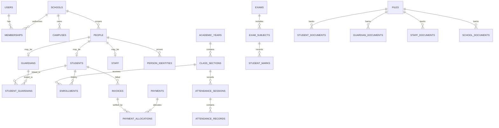

# Edvance NestJS + PostgreSQL backend blueprint

This is the implementation blueprint for the Edvance frontend. It defines the recommended build order, tenant boundary, PostgreSQL data model, Karachi/Sindh-specific inputs, document handling, and versioned NestJS endpoints.

The frontend keeps calling relative Next.js paths such as `/api/students`. Set the server-only `EDVANCE_BACKEND_URL` to the NestJS prefix, for example `https://internal-api.example.com/v1`, so the browser never receives the NestJS origin.

## 1. Recommended architecture

Use one PostgreSQL database and one shared application schema.

- `schools.id` is the tenant ID.
- Every tenant-owned row has a non-null `school_id`.
- Every campus-owned row has both `school_id` and `campus_id`.
- NestJS derives the allowed school IDs from the authenticated membership. Never trust a request's `schoolId` or `campusId` by itself.
- Application queries always filter by `school_id`; PostgreSQL row-level security (RLS) provides a second, fail-closed boundary.
- Use a normal non-owner database role for application traffic. The table owner and roles with `BYPASSRLS` can bypass RLS.
- Platform Super Admin operations use a separate, tightly controlled authorization path. Do not give the normal request role `BYPASSRLS`.
- Use database transactions for tenant context and every multi-row business operation.
- Keep uploaded file bytes in private S3-compatible object storage. PostgreSQL stores metadata and ownership links only.

Recommended request flow:

```text
Browser
  -> relative Next.js /api/*
  -> server-only gateway
  -> NestJS /v1/*
  -> authentication + policy guards
  -> transaction-local tenant context
  -> service/domain transaction
  -> PostgreSQL + private object storage
```

Core relationship map:



### NestJS modules

```text
AppModule
├── IdentityModule
│   ├── AuthModule
│   ├── UsersModule
│   ├── MembershipsModule
│   └── AuthorizationModule
├── TenancyModule
├── SchoolsModule
├── CampusesModule
├── AcademicsModule
├── PeopleModule
│   ├── StudentsModule
│   ├── GuardiansModule
│   └── StaffModule
├── DocumentsModule
├── AttendanceModule
├── FeesModule
├── ExamsModule
├── SubscriptionsModule
├── SettingsModule
├── ReportsModule
├── AuditModule
└── HealthModule
```

Use URI versioning (`/v1`) and generate OpenAPI from the same DTO/schema definitions used for runtime validation.

## 2. Build these APIs first

Do not begin with dashboards. Dashboards depend on almost every other module.

### Phase 0 — database and request foundation

1. Migrations, extensions, enums, naming conventions, and seed framework.
2. Request ID, structured logging, safe exception filter, and health checks.
3. Transaction wrapper and tenant-context interceptor.
4. RLS policies and cross-tenant integration tests.
5. Private file-storage adapter and malware-scan state machine.

### Phase 1 — authentication and workspace bootstrap

Implement these first because the frontend cannot safely integrate any protected module without them:

1. `POST /v1/auth/login`
2. `GET /v1/auth/session`
3. `POST /v1/auth/refresh` if refresh tokens are used
4. `DELETE /v1/auth/session`
5. `GET /v1/me/workspaces`
6. `GET /v1/schools/:schoolId/campuses`

Return an opaque same-origin session cookie through the Next.js boundary. Do not return a long-lived token for browser storage.

### Phase 2 — tenant and academic master data

Build schools, campuses, academic years, grades, sections, subjects, users, and memberships. Student, attendance, fee, and exam records all depend on this data.

### Phase 3 — people and documents

Build guardians and students first, then staff/teachers, identity records, and secure document uploads.

### Phase 4 onward

1. Attendance
2. Fees and payment allocation
3. Exams, marks, grades, and publication
4. Subscriptions and billing
5. Settings
6. Dashboards and reports last

## 3. PostgreSQL conventions

Use these conventions on every applicable table:

| Column        | Type          | Rule                                          |
| ------------- | ------------- | --------------------------------------------- |
| `id`          | `uuid`        | Primary key; generated server-side            |
| `school_id`   | `uuid`        | Non-null tenant key on tenant-owned data      |
| `created_at`  | `timestamptz` | Non-null, default `now()`                     |
| `created_by`  | `uuid`        | Nullable only for controlled system jobs      |
| `updated_at`  | `timestamptz` | Non-null, updated on mutation                 |
| `updated_by`  | `uuid`        | Actor responsible for the latest mutation     |
| `row_version` | `integer`     | Non-null default `1`; optimistic concurrency  |
| `deleted_at`  | `timestamptz` | Only where recoverable soft deletion is valid |

Additional rules:

- Use `timestamptz` for instants and `date` for school-calendar dates.
- Store the school timezone as `Asia/Karachi`; store instants in UTC.
- Use ISO 4217 `PKR` and store money as `amount_minor bigint` (paisa). Never use floating point for money.
- API money fields should be named `amountMinor`. If the existing frontend temporarily consumes whole rupees, convert in one API adapter and do not mix units.
- Normalize emails with `citext` or a lowercase generated value.
- Normalize phone numbers to E.164 where possible, such as `+923001234567`; keep an optional display value only when required.
- Use database `CHECK`, `UNIQUE`, and foreign-key constraints even when DTO validation already exists.
- Prefer status columns over deletion for students, staff, invoices, payments, exams, and registrations.
- Financial and audit records are never edited away: void, reverse, or supersede them.

Recommended PostgreSQL extensions:

```sql
CREATE EXTENSION IF NOT EXISTS pgcrypto;
CREATE EXTENSION IF NOT EXISTS citext;
CREATE EXTENSION IF NOT EXISTS pg_trgm;
```

## 4. Tenant isolation pattern

Every tenant table needs an RLS policy and composite references that cannot cross schools.

```sql
CREATE SCHEMA IF NOT EXISTS app;

CREATE FUNCTION app.current_school_id()
RETURNS uuid
LANGUAGE sql
STABLE
AS $$
  SELECT NULLIF(current_setting('app.school_id', true), '')::uuid
$$;

ALTER TABLE students ENABLE ROW LEVEL SECURITY;
ALTER TABLE students FORCE ROW LEVEL SECURITY;

CREATE POLICY students_tenant_policy ON students
  USING (school_id = app.current_school_id())
  WITH CHECK (school_id = app.current_school_id());
```

Set context only inside a transaction so pooled connections cannot leak tenant state:

```sql
BEGIN;
SELECT set_config('app.school_id', :school_id, true);
SELECT set_config('app.user_id', :user_id, true);
-- tenant queries
COMMIT;
```

For cross-tenant foreign-key protection:

```sql
ALTER TABLE campuses ADD CONSTRAINT campuses_school_id_id_key
  UNIQUE (school_id, id);

ALTER TABLE students ADD CONSTRAINT students_campus_tenant_fk
  FOREIGN KEY (school_id, campus_id)
  REFERENCES campuses (school_id, id);
```

Repeat this pattern for every relation between tenant tables. Test that a user from School A cannot read, create, update, link, or delete School B data, even when valid School B UUIDs are supplied.

## 5. Data dictionary

The following tables are the recommended normalized core. Columns marked sensitive must be encrypted or strictly access-controlled.

### 5.1 Platform identity and tenancy

#### `schools`

Global tenant registry.

| Field              | Type          | Required | Notes                                                                                         |
| ------------------ | ------------- | -------- | --------------------------------------------------------------------------------------------- |
| `id`               | `uuid`        | yes      | Tenant ID                                                                                     |
| `code`             | `citext`      | yes      | Globally unique short code                                                                    |
| `legal_name`       | `text`        | yes      | Registered institution name                                                                   |
| `display_name`     | `text`        | yes      | Name shown in UI                                                                              |
| `ownership_type`   | enum          | yes      | `private`, `public`, `trust`, `ngo`, `other`                                                  |
| `education_system` | enum          | yes      | `sindh_board`, `cambridge`, `ib`, `edexcel`, `mixed`, `other`                                 |
| `education_level`  | enum[]        | yes      | `pre_primary`, `primary`, `elementary`, `secondary`, `higher_secondary`, `o_level`, `a_level` |
| `gender_type`      | enum          | yes      | `coeducation`, `boys`, `girls`                                                                |
| `primary_email`    | `citext`      | yes      | Unique active contact                                                                         |
| `primary_phone`    | `varchar(16)` | yes      | E.164 normalized                                                                              |
| `website_url`      | `text`        | no       | HTTPS URL                                                                                     |
| `logo_file_id`     | `uuid`        | no       | Private/public asset reference as configured                                                  |
| `timezone`         | `text`        | yes      | Default `Asia/Karachi`                                                                        |
| `locale`           | `text`        | yes      | Default `en-PK`; allow `ur-PK`                                                                |
| `currency`         | `char(3)`     | yes      | Default `PKR`                                                                                 |
| `status`           | enum          | yes      | `trial`, `active`, `past_due`, `suspended`, `closed`                                          |
| `onboarded_at`     | `timestamptz` | no       | First completed onboarding                                                                    |
| audit columns      | —             | yes      | Creation/update/version                                                                       |

#### `school_registrations`

Keep regulatory history separate so renewals do not overwrite earlier certificates.

| Field                   | Type   | Required | Notes                                                                           |
| ----------------------- | ------ | -------- | ------------------------------------------------------------------------------- |
| `id`, `school_id`       | `uuid` | yes      | Tenant record                                                                   |
| `authority`             | `text` | yes      | Example: Directorate of Inspection & Registration of Private Institutions Sindh |
| `registration_number`   | `text` | yes      | Unique per authority                                                            |
| `registration_type`     | enum   | yes      | `new`, `renewal`, `recognition`, `affiliation`                                  |
| `status`                | enum   | yes      | `draft`, `submitted`, `active`, `expired`, `suspended`, `rejected`              |
| `issued_on`             | `date` | no       | Certificate issue date                                                          |
| `expires_on`            | `date` | no       | Renewal due date                                                                |
| `application_reference` | `text` | no       | Government submission reference                                                 |
| `notes`                 | `text` | no       | Internal compliance notes                                                       |
| audit columns           | —      | yes      | Include actor                                                                   |

Unique: `(school_id, authority, registration_number)`.

#### `campuses`

| Field                     | Type            | Required | Notes                                           |
| ------------------------- | --------------- | -------- | ----------------------------------------------- |
| `id`, `school_id`         | `uuid`          | yes      | Composite tenant identity                       |
| `code`                    | `citext`        | yes      | Unique within school                            |
| `name`                    | `text`          | yes      | Campus/branch name                              |
| `email`                   | `citext`        | no       | Campus contact                                  |
| `phone`                   | `varchar(16)`   | yes      | E.164 normalized                                |
| `address_id`              | `uuid`          | yes      | Karachi address                                 |
| `principal_staff_id`      | `uuid`          | no       | Set after staff creation                        |
| `shift`                   | enum            | yes      | `morning`, `evening`, `both`                    |
| `plot_area_sq_yards`      | `numeric(10,2)` | no       | Compliance detail                               |
| `building_ownership`      | enum            | no       | `owned`, `leased`, `rented`, `other`            |
| `classroom_count`         | `smallint`      | no       | Non-negative                                    |
| `student_capacity`        | `integer`       | no       | Non-negative                                    |
| `has_science_lab`         | `boolean`       | yes      | Default false                                   |
| `has_library`             | `boolean`       | yes      | Default false                                   |
| `has_safe_drinking_water` | `boolean`       | yes      | Default false                                   |
| `has_cctv`                | `boolean`       | yes      | Store compliance state, never CCTV footage here |
| `active`                  | `boolean`       | yes      | Default true                                    |
| audit columns             | —               | yes      | —                                               |

Unique: `(school_id, code)` and `(school_id, id)`.

#### `addresses`

| Field                   | Type          | Required | Notes                                                                                             |
| ----------------------- | ------------- | -------- | ------------------------------------------------------------------------------------------------- |
| `id`, `school_id`       | `uuid`        | yes      | Tenant-scoped reusable address                                                                    |
| `line_1`                | `text`        | yes      | House/plot/building and street                                                                    |
| `line_2`                | `text`        | no       | Block/sector                                                                                      |
| `landmark`              | `text`        | no       | Local directions                                                                                  |
| `area`                  | `text`        | yes      | Examples: Gulshan-e-Iqbal, Clifton                                                                |
| `subdivision`           | `text`        | no       | Administrative subdivision/town                                                                   |
| `district`              | enum          | yes      | `karachi_central`, `karachi_east`, `karachi_south`, `karachi_west`, `keamari`, `korangi`, `malir` |
| `union_council`         | `text`        | no       | Do not hardcode names; maintain reference data                                                    |
| `city`                  | `text`        | yes      | Default `Karachi`                                                                                 |
| `province`              | `text`        | yes      | Default `Sindh`                                                                                   |
| `postal_code`           | `varchar(10)` | no       | Validated string, not integer                                                                     |
| `country_code`          | `char(2)`     | yes      | Default `PK`                                                                                      |
| `latitude`, `longitude` | `numeric`     | no       | Optional, restrict precision for home addresses                                                   |
| audit columns           | —             | yes      | —                                                                                                 |

### 5.2 Users, roles, and sessions

#### `users`

| Field                   | Type          | Required | Notes                                                  |
| ----------------------- | ------------- | -------- | ------------------------------------------------------ |
| `id`                    | `uuid`        | yes      | Global user identity                                   |
| `email`                 | `citext`      | yes      | Globally unique normalized login                       |
| `phone`                 | `varchar(16)` | no       | E.164                                                  |
| `display_name`          | `text`        | yes      | —                                                      |
| `password_hash`         | `text`        | yes      | Argon2id or bcrypt; never plaintext                    |
| `status`                | enum          | yes      | `invited`, `active`, `locked`, `suspended`, `disabled` |
| `email_verified_at`     | `timestamptz` | no       | —                                                      |
| `mfa_enabled`           | `boolean`     | yes      | Default false                                          |
| `mfa_secret_ciphertext` | `bytea`       | no       | Encrypted; never returned                              |
| `failed_login_count`    | `smallint`    | yes      | Default 0                                              |
| `locked_until`          | `timestamptz` | no       | —                                                      |
| `last_login_at`         | `timestamptz` | no       | —                                                      |
| audit columns           | —             | yes      | —                                                      |

#### `memberships`

| Field                                     | Type      | Required | Notes                                                                                                               |
| ----------------------------------------- | --------- | -------- | ------------------------------------------------------------------------------------------------------------------- |
| `id`                                      | `uuid`    | yes      | —                                                                                                                   |
| `user_id`                                 | `uuid`    | yes      | User                                                                                                                |
| `school_id`                               | `uuid`    | no       | Null only for platform Super Admin membership                                                                       |
| `role`                                    | enum      | yes      | `super_admin`, `school_admin`, `principal`, `teacher`, `accountant`, `attendance_officer`, `exam_officer`, `viewer` |
| `status`                                  | enum      | yes      | `invited`, `active`, `suspended`                                                                                    |
| `all_campuses`                            | `boolean` | yes      | Default false                                                                                                       |
| `invited_by`, `invited_at`, `accepted_at` | mixed     | no       | Invitation audit                                                                                                    |
| audit columns                             | —         | yes      | —                                                                                                                   |

Unique active membership: `(user_id, school_id, role)`. Add `membership_campuses(membership_id, school_id, campus_id)` when `all_campuses=false`.

#### `sessions`

| Field           | Type          | Required | Notes                                     |
| --------------- | ------------- | -------- | ----------------------------------------- |
| `id`, `user_id` | `uuid`        | yes      | Session identity                          |
| `token_hash`    | `bytea`       | yes      | Store only a keyed hash of opaque token   |
| `expires_at`    | `timestamptz` | yes      | —                                         |
| `last_seen_at`  | `timestamptz` | yes      | —                                         |
| `revoked_at`    | `timestamptz` | no       | Logout/revocation                         |
| `ip_hash`       | `bytea`       | no       | Avoid retaining raw IP longer than needed |
| `user_agent`    | `text`        | no       | Limit length                              |
| `created_at`    | `timestamptz` | yes      | —                                         |

Add separate one-time `password_reset_tokens` and `invitation_tokens` tables. Store token hashes, purpose, expiry, used timestamp, and attempt count; never store raw tokens.

### 5.3 People, CNIC/B-Form, guardians, students, and staff

#### `people`

Shared biographical record within one school tenant.

| Field                        | Type          | Required | Notes                                                                                     |
| ---------------------------- | ------------- | -------- | ----------------------------------------------------------------------------------------- |
| `id`, `school_id`            | `uuid`        | yes      | —                                                                                         |
| `first_name`                 | `text`        | yes      | Unicode, trimmed                                                                          |
| `middle_name`                | `text`        | no       | —                                                                                         |
| `last_name`                  | `text`        | no       | Do not force where a person uses one name                                                 |
| `preferred_name`             | `text`        | no       | —                                                                                         |
| `date_of_birth`              | `date`        | no       | Required for enrolled students; allow an exception workflow when age proof is unavailable |
| `gender`                     | enum          | yes      | Product-approved values; avoid free text in reports                                       |
| `nationality_code`           | `char(2)`     | yes      | Default `PK`                                                                              |
| `blood_group`                | enum          | no       | Sensitive; collect only if operationally needed                                           |
| `primary_phone`              | `varchar(16)` | no       | E.164                                                                                     |
| `alternate_phone`            | `varchar(16)` | no       | —                                                                                         |
| `email`                      | `citext`      | no       | —                                                                                         |
| `address_id`                 | `uuid`        | no       | Composite tenant FK                                                                       |
| `photo_file_id`              | `uuid`        | no       | Private file reference                                                                    |
| `emergency_notes_ciphertext` | `bytea`       | no       | Only if required; tightly restricted                                                      |
| audit columns                | —             | yes      | —                                                                                         |

#### `person_identities`

Use this table for CNIC, NICOP, POC, passport, Juvenile Card, and Child Registration Certificate (CRC/B-Form).

| Field                          | Type      | Required | Notes                                                                      |
| ------------------------------ | --------- | -------- | -------------------------------------------------------------------------- |
| `id`, `school_id`, `person_id` | `uuid`    | yes      | Composite tenant FK                                                        |
| `identity_type`                | enum      | yes      | `cnic`, `nicop`, `poc`, `passport`, `juvenile_card`, `crc_b_form`, `other` |
| `number_ciphertext`            | `bytea`   | yes      | AES-256-GCM envelope encryption                                            |
| `number_lookup_hash`           | `bytea`   | yes      | HMAC-SHA-256 over type + normalized value                                  |
| `number_last4`                 | `char(4)` | yes      | Masked UI display only                                                     |
| `issuing_country`              | `char(2)` | yes      | Default `PK`                                                               |
| `issued_on`                    | `date`    | no       | —                                                                          |
| `expires_on`                   | `date`    | no       | CNIC/passport where applicable                                             |
| `verified_at`, `verified_by`   | mixed     | no       | Internal verification event                                                |
| audit columns                  | —         | yes      | Never include the full number in audit payloads                            |

For CNIC input, accept `#####-#######-#` or 13 digits, strip separators, then validate exactly 13 digits before encrypting. Display only `*****-*******-1234` or the minimum useful mask. Do not assume every CRC/B-Form legacy value follows one format; support a documented exception state rather than inventing or rejecting a child's identity. Never log full identity numbers.

Unique: `(school_id, identity_type, number_lookup_hash)` where active.

#### `guardians`

| Field                          | Type          | Required | Notes                                |
| ------------------------------ | ------------- | -------- | ------------------------------------ |
| `id`, `school_id`, `person_id` | `uuid`        | yes      | —                                    |
| `occupation`                   | `text`        | no       | —                                    |
| `employer`                     | `text`        | no       | —                                    |
| `work_phone`                   | `varchar(16)` | no       | E.164                                |
| `preferred_language`           | enum          | yes      | `english`, `urdu`, `sindhi`, `other` |
| `portal_user_id`               | `uuid`        | no       | Optional parent portal account       |
| audit columns                  | —             | yes      | —                                    |

#### `students`

| Field                          | Type           | Required | Notes                                                                               |
| ------------------------------ | -------------- | -------- | ----------------------------------------------------------------------------------- |
| `id`, `school_id`, `person_id` | `uuid`         | yes      | —                                                                                   |
| `admission_number`             | `citext`       | yes      | Unique within school                                                                |
| `admission_date`               | `date`         | yes      | —                                                                                   |
| `admission_status`             | enum           | yes      | `applicant`, `active`, `inactive`, `withdrawn`, `graduated`, `expelled`, `deceased` |
| `campus_id`                    | `uuid`         | yes      | Current primary campus                                                              |
| `house_id`                     | `uuid`         | no       | —                                                                                   |
| `previous_school_name`         | `text`         | no       | —                                                                                   |
| `previous_school_last_grade`   | `text`         | no       | —                                                                                   |
| `transport_required`           | `boolean`      | yes      | Default false; transport module can follow later                                    |
| `scholarship_percentage`       | `numeric(5,2)` | no       | Keep authorization and reason separately                                            |
| `scholarship_reason`           | `text`         | no       | Restricted access                                                                   |
| `withdrawal_date`              | `date`         | no       | Required when withdrawn                                                             |
| `withdrawal_reason`            | `text`         | no       | —                                                                                   |
| audit columns                  | —              | yes      | Do not hard-delete normal historical records                                        |

#### `student_guardians`

| Field                                    | Type      | Required | Notes                                                             |
| ---------------------------------------- | --------- | -------- | ----------------------------------------------------------------- |
| `school_id`, `student_id`, `guardian_id` | `uuid`    | yes      | Composite primary/foreign keys                                    |
| `relationship`                           | enum      | yes      | `father`, `mother`, `guardian`, `grandparent`, `sibling`, `other` |
| `is_primary`                             | `boolean` | yes      | One primary per active student                                    |
| `is_emergency_contact`                   | `boolean` | yes      | —                                                                 |
| `is_fee_contact`                         | `boolean` | yes      | —                                                                 |
| `authorized_pickup`                      | `boolean` | yes      | —                                                                 |
| `lives_with_student`                     | `boolean` | yes      | —                                                                 |
| `court_restriction_notes_ciphertext`     | `bytea`   | no       | Extremely restricted, only if necessary                           |
| audit columns                            | —         | yes      | —                                                                 |

#### `staff`

| Field                          | Type     | Required | Notes                                                                  |
| ------------------------------ | -------- | -------- | ---------------------------------------------------------------------- |
| `id`, `school_id`, `person_id` | `uuid`   | yes      | —                                                                      |
| `employee_number`              | `citext` | yes      | Unique within school                                                   |
| `campus_id`                    | `uuid`   | yes      | Primary campus                                                         |
| `designation`                  | `text`   | yes      | Teacher, principal, accountant, etc.                                   |
| `employment_type`              | enum     | yes      | `full_time`, `part_time`, `contract`, `visiting`                       |
| `employment_status`            | enum     | yes      | `active`, `on_leave`, `suspended`, `resigned`, `terminated`, `retired` |
| `joining_date`                 | `date`   | yes      | —                                                                      |
| `leaving_date`                 | `date`   | no       | —                                                                      |
| `qualification_summary`        | `text`   | no       | Detailed qualifications are separate                                   |
| `specialization`               | `text`   | no       | —                                                                      |
| `payroll_reference`            | `text`   | no       | Do not put bank details in this table                                  |
| `portal_user_id`               | `uuid`   | no       | Optional login                                                         |
| audit columns                  | —        | yes      | —                                                                      |

Add `staff_qualifications(id, school_id, staff_id, title, institution, completion_year, grade, verified_at, verified_by)` and `teacher_assignments(id, school_id, staff_id, class_section_id, subject_id, academic_year_id, start_date, end_date)`.

### 5.4 Academic structure and enrollment

#### `academic_years`

`id`, `school_id`, `name`, `starts_on`, `ends_on`, `status(draft|active|closed)`, `is_current`, audit columns. Enforce one current year per school with a partial unique index.

#### `academic_terms`

`id`, `school_id`, `academic_year_id`, `name`, `sequence`, `starts_on`, `ends_on`, `status`, audit columns. Unique `(school_id, academic_year_id, sequence)`.

#### `grade_levels`

`id`, `school_id`, `code`, `name`, `numeric_level`, `education_level`, `sort_order`, `active`, audit columns. Do not hardcode only Grades 5–10 in the backend.

#### `subjects`

`id`, `school_id`, `code`, `name`, `category`, `default_max_marks`, `active`, audit columns. Seed Karachi-appropriate examples such as English, Urdu, Sindhi, Mathematics, General Science, Computer Science, Pakistan Studies, Islamiyat/Ethics, Physics, Chemistry, Biology, and Social Studies, but let each school configure its curriculum.

#### `class_sections`

`id`, `school_id`, `campus_id`, `academic_year_id`, `grade_level_id`, `section_name`, `room`, `capacity`, `class_teacher_staff_id`, `active`, audit columns. Unique `(school_id, campus_id, academic_year_id, grade_level_id, section_name)`.

#### `class_section_subjects`

`id`, `school_id`, `class_section_id`, `subject_id`, `teacher_staff_id`, `weekly_periods`, `active`, audit columns.

#### `enrollments`

| Field                                               | Type   | Required | Notes                                                                     |
| --------------------------------------------------- | ------ | -------- | ------------------------------------------------------------------------- |
| `id`, `school_id`, `student_id`                     | `uuid` | yes      | —                                                                         |
| `academic_year_id`, `campus_id`, `class_section_id` | `uuid` | yes      | Composite tenant FKs                                                      |
| `roll_number`                                       | `text` | yes      | Unique within section/year                                                |
| `status`                                            | enum   | yes      | `active`, `promoted`, `repeated`, `transferred`, `withdrawn`, `completed` |
| `joined_on`, `left_on`                              | `date` | mixed    | —                                                                         |
| `promotion_from_enrollment_id`                      | `uuid` | no       | History link                                                              |
| audit columns                                       | —      | yes      | —                                                                         |

Do not overwrite a student's class when promoting them. Close the old enrollment and create a new one.

### 5.5 Documents and uploads

#### `files`

| Field                        | Type     | Required | Notes                                                                            |
| ---------------------------- | -------- | -------- | -------------------------------------------------------------------------------- |
| `id`, `school_id`            | `uuid`   | yes      | Tenant-owned metadata                                                            |
| `storage_provider`           | enum     | yes      | `s3`, `r2`, `minio`, etc.                                                        |
| `bucket`                     | `text`   | yes      | Server-only                                                                      |
| `storage_key`                | `text`   | yes      | Random UUID path, unique; never user supplied                                    |
| `original_name`              | `text`   | yes      | Sanitized display only                                                           |
| `media_type`                 | `text`   | yes      | Detected MIME type, not only request header                                      |
| `extension`                  | `text`   | yes      | Allowlisted                                                                      |
| `size_bytes`                 | `bigint` | yes      | Enforce per-type limit                                                           |
| `sha256`                     | `bytea`  | yes      | Integrity/deduplication signal                                                   |
| `classification`             | enum     | yes      | `public`, `internal`, `confidential`, `restricted_identity`, `restricted_health` |
| `scan_status`                | enum     | yes      | `pending`, `clean`, `rejected`, `failed`                                         |
| `uploaded_by`, `uploaded_at` | mixed    | yes      | Audit                                                                            |
| `retention_until`            | `date`   | no       | Policy-driven                                                                    |
| `deleted_at`, `deleted_by`   | mixed    | no       | Controlled deletion                                                              |

Never expose `bucket` or `storage_key` directly in resource responses. Return a short-lived authorized download URL or stream through an authorized endpoint.

Use explicit relation tables instead of a polymorphic `owner_type/owner_id` that cannot have foreign keys:

- `school_documents(id, school_id, school_registration_id?, file_id, document_type, document_number_ciphertext?, issued_on?, expires_on?, verified_at?, verified_by?, status)`
- `student_documents(id, school_id, student_id, file_id, document_type, issued_on?, expires_on?, verified_at?, verified_by?, status)`
- `guardian_documents(id, school_id, guardian_id, file_id, document_type, verified_at?, verified_by?, status)`
- `staff_documents(id, school_id, staff_id, file_id, document_type, issued_on?, expires_on?, verified_at?, verified_by?, status)`

Suggested document types:

| Owner    | Document types                                                                                                                                                                                                                                                                                                 |
| -------- | -------------------------------------------------------------------------------------------------------------------------------------------------------------------------------------------------------------------------------------------------------------------------------------------------------------- |
| School   | registration certificate, renewal, approved building/map plan, ownership/lease evidence, affiliation, laboratory inventory, library inventory, teacher qualification/training record, drinking-water evidence, CCTV compliance declaration, scholarship/freeship policy, tax/bank evidence only where required |
| Student  | CRC/B-Form, birth/age proof, passport/NICOP where applicable, photograph, previous result card, school-leaving certificate, transfer certificate, vaccination/medical record only when legitimately required                                                                                                   |
| Guardian | CNIC/NICOP/passport front/back, guardianship/custody proof where applicable, authorization letter                                                                                                                                                                                                              |
| Staff    | CNIC/NICOP/passport, photograph, degree/certificate, experience letter, employment contract, training certificate, background/police verification only if school policy and applicable law permit it                                                                                                           |

Sindh rules recognize multiple forms of age proof and state that a child should not be denied admission solely because proof of age is missing. Model `age_proof_status = provided | pending | exception_approved`, rather than making a B-Form upload an unconditional database constraint.

### 5.6 Attendance

#### `attendance_sessions`

`id`, `school_id`, `campus_id`, `class_section_id`, `attendance_date`, `session_type(daily|morning|evening)`, `status(draft|finalized|reopened)`, `marked_by`, `finalized_at`, `reopened_by`, `reopened_at`, `reopen_reason`, audit/version columns.

Unique `(school_id, class_section_id, attendance_date, session_type)`.

#### `attendance_records`

`id`, `school_id`, `attendance_session_id`, `student_id`, `enrollment_id`, `status(present|absent|late|leave)`, `note`, `arrival_time`, `leave_type`, audit columns.

Unique `(school_id, attendance_session_id, student_id)`. NestJS verifies that the student had an active enrollment in the section on the attendance date.

### 5.7 Fees, invoices, and payments

#### `fee_heads`

`id`, `school_id`, `code`, `name`, `category(tuition|admission|exam|transport|annual|fine|discount|other)`, `refundable`, `active`, audit columns.

#### `fee_structures` and `fee_structure_items`

- `fee_structures`: `id`, `school_id`, `campus_id`, `academic_year_id`, `grade_level_id`, `name`, `frequency(monthly|term|annual|one_time)`, `effective_from`, `effective_to`, `active`, audit columns.
- `fee_structure_items`: `id`, `school_id`, `fee_structure_id`, `fee_head_id`, `amount_minor`, `due_day`, `optional`, audit columns.

#### `student_fee_assignments`

`id`, `school_id`, `student_id`, `enrollment_id`, `fee_structure_id`, `starts_on`, `ends_on`, `discount_type(none|fixed|percentage)`, `discount_value`, `discount_reason`, `approved_by`, audit columns.

#### `invoices` and `invoice_items`

- `invoices`: `id`, `school_id`, `campus_id`, `student_id`, `enrollment_id`, `invoice_number`, `currency`, `issued_on`, `due_on`, `status(draft|issued|partial|paid|overdue|void)`, `subtotal_minor`, `discount_minor`, `late_fee_minor`, `total_minor`, `paid_minor`, `balance_minor`, `voided_at`, `voided_by`, `void_reason`, audit/version columns.
- `invoice_items`: `id`, `school_id`, `invoice_id`, `fee_head_id`, `description`, `quantity`, `unit_amount_minor`, `discount_minor`, `line_total_minor`, `service_period_start`, `service_period_end`.

Unique `(school_id, invoice_number)`. Totals are calculated server-side inside the transaction.

#### `payments`, `payment_allocations`, and `refunds`

- `payments`: `id`, `school_id`, `campus_id`, `receipt_number`, `amount_minor`, `currency`, `method(cash|bank_transfer|card|mobile_wallet|cheque)`, `received_on`, `reference`, `payer_name`, `status(pending|confirmed|failed|reversed)`, `idempotency_key`, `received_by`, audit columns.
- `payment_allocations`: `id`, `school_id`, `payment_id`, `invoice_id`, `amount_minor`, audit columns.
- `refunds`: `id`, `school_id`, `payment_id`, `amount_minor`, `reason`, `status`, `approved_by`, `processed_at`, `reference`, audit columns.

Unique `(school_id, receipt_number)` and `(school_id, idempotency_key)`. Lock affected invoices during allocation and enforce that allocations never exceed the payment or invoice balance.

### 5.8 Exams and results

- `grading_scales`: `id`, `school_id`, `name`, `active`, audit columns.
- `grading_scale_bands`: `id`, `school_id`, `grading_scale_id`, `minimum_percentage`, `maximum_percentage`, `grade`, `gpa_value?`, `result(pass|fail)`, `sort_order`.
- `exams`: `id`, `school_id`, `campus_id`, `academic_year_id`, `academic_term_id`, `name`, `exam_type`, `starts_on`, `ends_on`, `status(draft|scheduled|in_progress|completed|published|archived)`, `published_at`, `published_by`, audit/version columns.
- `exam_class_sections`: `id`, `school_id`, `exam_id`, `class_section_id`, unique per exam/section.
- `exam_subjects`: `id`, `school_id`, `exam_class_section_id`, `subject_id`, `exam_date`, `max_marks`, `pass_marks`, `weight`, audit columns.
- `student_marks`: `id`, `school_id`, `exam_subject_id`, `student_id`, `enrollment_id`, `marks_obtained numeric(7,2)`, `is_absent`, `remarks`, `entered_by`, `entered_at`, audit/version columns.
- `student_exam_results`: optional materialized summary with `exam_id`, `class_section_id`, `student_id`, totals, percentage, grade, result, rank, calculated_at`; it must be reproducible from marks and versioned when published.

Unique `(school_id, exam_subject_id, student_id)`. Enforce `0 <= marks_obtained <= max_marks`; absence uses `is_absent=true` and `marks_obtained=NULL`.

### 5.9 Settings, subscription, reporting, and audit

#### `school_settings`

Use typed relational columns for settings used in queries or validation: `school_id`, `academic_year_id`, `week_starts_on`, `grading_scale_id`, `default_pass_mark`, `attendance_lock_hours`, `allow_teacher_notes`, `guardian_absence_alerts`, `monthly_fee_due_day`, `late_fee_minor`, `online_payments_enabled`, notification flags, audit/version columns. Use a small `jsonb` `extra_settings` only for non-critical extension values.

#### `platform_settings`

Singleton/versioned table: platform name, support email, timezone, locale, MFA requirement, session timeout, invitation expiry, minimum password length, notification flags, audit/version columns.

#### `plans`, `school_subscriptions`, and `subscription_invoices`

- `plans`: code, name, price_minor, billing_interval, feature limits, active.
- `school_subscriptions`: school, plan, status, started/trial/renewal/cancel dates, agreed price, audit columns.
- `subscription_invoices`: immutable platform billing record with amount, due date, paid date, status, provider references.

#### `audit_events`

| Field                      | Type          | Required | Notes                                    |
| -------------------------- | ------------- | -------- | ---------------------------------------- |
| `id`                       | `uuid`        | yes      | —                                        |
| `school_id`                | `uuid`        | no       | Null for platform-only event             |
| `actor_user_id`            | `uuid`        | no       | Null only for system job                 |
| `request_id`               | `text`        | yes      | Correlates Next.js, NestJS, and DB event |
| `action`                   | `text`        | yes      | Example `student.identity.viewed`        |
| `entity_type`, `entity_id` | mixed         | yes      | Target                                   |
| `result`                   | enum          | yes      | `success`, `denied`, `failure`           |
| `changed_fields`           | `text[]`      | no       | Field names only for sensitive records   |
| `metadata`                 | `jsonb`       | yes      | Allowlisted, redacted metadata           |
| `occurred_at`              | `timestamptz` | yes      | Immutable timestamp                      |

Audit CNIC/document reads as well as writes. Never place passwords, tokens, complete CNIC/B-Form numbers, medical data, or raw document contents in logs/audit JSON.

## 6. API endpoint inventory

NestJS paths below use `/v1`. The browser continues to use the corresponding relative `/api/...` path through Next.js.

### Authentication and current workspace — implement first

| Method   | NestJS path                | Purpose                                                             |
| -------- | -------------------------- | ------------------------------------------------------------------- |
| `POST`   | `/v1/auth/login`           | Validate credentials, create session, return user/workspace summary |
| `GET`    | `/v1/auth/session`         | Hydrate current user and active membership                          |
| `POST`   | `/v1/auth/refresh`         | Rotate refresh/session token if used                                |
| `DELETE` | `/v1/auth/session`         | Revoke current session                                              |
| `POST`   | `/v1/auth/forgot-password` | Issue single-use reset workflow                                     |
| `POST`   | `/v1/auth/reset-password`  | Consume reset token and revoke old sessions                         |
| `POST`   | `/v1/auth/mfa/challenge`   | Verify MFA challenge                                                |
| `GET`    | `/v1/me/workspaces`        | List authorized school/campus memberships                           |
| `PUT`    | `/v1/me/preferences`       | Locale/theme/non-sensitive preferences                              |

### Schools, campuses, users, and membership

| Method      | NestJS path                                | Purpose                                    |
| ----------- | ------------------------------------------ | ------------------------------------------ |
| `GET/POST`  | `/v1/schools`                              | Platform school list/create                |
| `GET/PATCH` | `/v1/schools/:schoolId`                    | School detail/update                       |
| `POST`      | `/v1/schools/:schoolId/suspend`            | Guarded state transition                   |
| `GET/POST`  | `/v1/schools/:schoolId/registrations`      | Regulatory history                         |
| `PATCH`     | `/v1/schools/:schoolId/registrations/:id`  | Registration status/details                |
| `GET/POST`  | `/v1/schools/:schoolId/campuses`           | Campus list/create                         |
| `GET/PATCH` | `/v1/schools/:schoolId/campuses/:campusId` | Campus detail/update                       |
| `GET/POST`  | `/v1/users`                                | Platform-authorized user list/invite       |
| `GET/PATCH` | `/v1/users/:userId`                        | User profile/status                        |
| `PATCH`     | `/v1/users/:userId/status`                 | Frontend-compatible guarded status command |
| `POST`      | `/v1/users/:userId/password-reset`         | Admin-triggered reset workflow             |
| `GET/POST`  | `/v1/memberships`                          | Tenant role assignments                    |
| `PATCH`     | `/v1/memberships/:id`                      | Scope/status changes                       |

### Academic master data

Provide `GET/POST` collections and `GET/PATCH` detail endpoints for:

- `/v1/academic-years`
- `/v1/academic-years/:yearId/terms`
- `/v1/grade-levels`
- `/v1/subjects`
- `/v1/class-sections`
- `/v1/class-sections/:id/subjects`
- `/v1/class-sections/:id/teacher-assignments`

Expose frontend-compatible class projections as `GET /v1/classes` and `GET /v1/classes/:classSectionId`. They read the same `class_sections` records; they are not duplicate tables.

All collection endpoints accept `campusId`, `academicYearId`, `search`, `status`, `page`, and `pageSize` where applicable.

### Students and guardians

| Method         | NestJS path                                     | Purpose                                                        |
| -------------- | ----------------------------------------------- | -------------------------------------------------------------- |
| `GET/POST`     | `/v1/students`                                  | Search/create; create may accept nested initial guardian links |
| `GET/PATCH`    | `/v1/students/:studentId`                       | Complete profile/update                                        |
| `POST`         | `/v1/students/:studentId/withdraw`              | Close active enrollment with reason                            |
| `GET/POST`     | `/v1/students/:studentId/enrollments`           | Enrollment history/create transfer or promotion                |
| `GET/POST`     | `/v1/students/:studentId/guardians`             | Guardian links                                                 |
| `PATCH/DELETE` | `/v1/students/:studentId/guardians/:guardianId` | Link attributes/remove link                                    |
| `GET/POST`     | `/v1/guardians`                                 | Search/create guardian                                         |
| `GET/PATCH`    | `/v1/guardians/:guardianId`                     | Guardian details                                               |
| `GET/POST`     | `/v1/students/:studentId/identities`            | Restricted B-Form/CRC metadata                                 |
| `GET/POST`     | `/v1/guardians/:guardianId/identities`          | Restricted CNIC metadata                                       |
| `GET/POST`     | `/v1/students/:studentId/documents`             | Document metadata/link                                         |
| `GET/DELETE`   | `/v1/students/:studentId/documents/:documentId` | Authorized download/delete workflow                            |

List filters should cover `campusId`, `classSectionId`, `gradeLevelId`, `status`, `search`, pagination, and stable sorting. Search should use names/admission number/guardian phone; full CNIC search must be a separate permission-gated exact lookup using the HMAC index.

### Staff and teachers

| Method      | NestJS path                                    | Purpose                   |
| ----------- | ---------------------------------------------- | ------------------------- |
| `GET/POST`  | `/v1/staff`                                    | Staff directory/create    |
| `GET/PATCH` | `/v1/staff/:staffId`                           | Detail/update             |
| `POST`      | `/v1/staff/:staffId/end-employment`            | Status transition         |
| `GET/POST`  | `/v1/staff/:staffId/qualifications`            | Qualification history     |
| `GET/POST`  | `/v1/staff/:staffId/assignments`               | Class/subject assignments |
| `DELETE`    | `/v1/staff/:staffId/assignments/:assignmentId` | End/remove assignment     |
| `GET/POST`  | `/v1/staff/:staffId/identities`                | Restricted CNIC metadata  |
| `GET/POST`  | `/v1/staff/:staffId/documents`                 | Staff documents           |

Expose `GET/POST /v1/teachers` and `GET/PATCH /v1/teachers/:teacherId` as frontend-compatible controllers over staff records whose designation/capability is teacher. They use the same services and tables; they do not create a second teacher store.

### Secure file flow

| Method   | NestJS path                          | Purpose                                                          |
| -------- | ------------------------------------ | ---------------------------------------------------------------- |
| `POST`   | `/v1/files/upload-intents`           | Authorize type/size/owner and issue short-lived presigned upload |
| `POST`   | `/v1/files/:fileId/complete`         | Verify object metadata and queue scan                            |
| `GET`    | `/v1/files/:fileId/status`           | Return pending/clean/rejected state                              |
| `POST`   | `/v1/files/:fileId/download-intents` | Permission-check and issue short-lived download                  |
| `DELETE` | `/v1/files/:fileId`                  | Policy-controlled deletion plus audit                            |

Allow only required formats such as PDF, JPEG, and PNG; validate extension, detected MIME, file signature, size, authorization, and malware scan. Use generated storage keys and private buckets.

### Attendance

| Method | NestJS path                          | Purpose                                         |
| ------ | ------------------------------------ | ----------------------------------------------- |
| `GET`  | `/v1/attendance/sheets`              | `classSectionId`, `date`, optional session type |
| `PUT`  | `/v1/attendance/sheets`              | Atomic upsert with `rowVersion`                 |
| `POST` | `/v1/attendance/sheets/:id/finalize` | Lock/finalize sheet                             |
| `POST` | `/v1/attendance/sheets/:id/reopen`   | Permission-gated correction with reason         |
| `GET`  | `/v1/attendance/reports`             | Daily/weekly/monthly/student/class report       |

### Fees

| Method      | NestJS path                     | Purpose                           |
| ----------- | ------------------------------- | --------------------------------- |
| `GET/POST`  | `/v1/fees/heads`                | Fee categories                    |
| `GET/POST`  | `/v1/fees/structures`           | Structure list/create             |
| `GET/PATCH` | `/v1/fees/structures/:id`       | Update future-effective structure |
| `GET/POST`  | `/v1/fees/invoices`             | List/generate invoice             |
| `GET`       | `/v1/fees/invoices/:id`         | Invoice detail and allocations    |
| `POST`      | `/v1/fees/invoices/:id/void`    | Audited void action               |
| `GET/POST`  | `/v1/fees/payments`             | Payment list/record               |
| `GET`       | `/v1/fees/payments/:id`         | Receipt detail                    |
| `POST`      | `/v1/fees/payments/:id/refunds` | Controlled refund                 |
| `GET`       | `/v1/fees/defaulters`           | Derived outstanding accounts      |
| `GET`       | `/v1/fees/overview`             | Derived summary                   |

Require an `Idempotency-Key` header for payment creation and invoice batch generation.

### Exams and results

| Method      | NestJS path                        | Purpose                              |
| ----------- | ---------------------------------- | ------------------------------------ |
| `GET/POST`  | `/v1/exams`                        | List/create exam                     |
| `GET/PATCH` | `/v1/exams/:id`                    | Detail/update draft                  |
| `GET`       | `/v1/exams/:id/summary`            | Derived summary                      |
| `GET/PUT`   | `/v1/exams/:id/results`            | Class result list/atomic marks save  |
| `GET`       | `/v1/exams/:id/results/:studentId` | Student result                       |
| `POST`      | `/v1/exams/:id/publish`            | Freeze calculation and publish       |
| `POST`      | `/v1/exams/:id/unpublish`          | Permission-gated correction workflow |

### Settings, subscriptions, dashboards, and reports

| Method    | NestJS path                   | Purpose                                |
| --------- | ----------------------------- | -------------------------------------- |
| `GET/PUT` | `/v1/settings/platform`       | Platform settings; Super Admin only    |
| `GET/PUT` | `/v1/settings/school`         | Current authorized school settings     |
| `GET`     | `/v1/subscriptions`           | Plans and school subscription overview |
| `GET`     | `/v1/billing`                 | Platform billing overview              |
| `GET`     | `/v1/subscriptions/usage`     | Usage limits/consumption               |
| `GET`     | `/v1/super-admin/dashboard`   | Platform aggregates                    |
| `GET`     | `/v1/school-admin/dashboard`  | Tenant/campus aggregates               |
| `GET`     | `/v1/reports`                 | School reports                         |
| `POST`    | `/v1/reports/export`          | Queued or bounded synchronous export   |
| `GET`     | `/v1/reports/platform`        | Platform reports                       |
| `POST`    | `/v1/reports/platform/export` | Platform export                        |

Dashboards and reports are read models. Calculate them from authoritative domain tables or maintained aggregates; never make dashboard cards the source of truth.

### Frontend compatibility rule

The existing Next.js gateway appends the browser path to `EDVANCE_BACKEND_URL`; it does not rename resources. For the first integration, NestJS should therefore expose the existing resource names under `/v1`:

- `/v1/schools`, `/v1/users`, `/v1/students`, `/v1/teachers`, and `/v1/classes`
- `/v1/attendance`, `/v1/fees`, `/v1/exams`, and `/v1/reports`
- `/v1/subscriptions`, `/v1/billing`, `/v1/settings`, and both dashboard paths

Path-parameter labels such as `:id` versus `:studentId` are documentation-only and do not affect routing. If the backend intentionally uses a different public path such as `/v1/staff`, add a dedicated Next.js route adapter; do not expose the backend origin or spread path translation throughout frontend components.

## 7. DTO and response rules

Global NestJS validation should:

- transform known primitives;
- reject or strip unknown properties consistently;
- validate UUIDs, enums, dates, page bounds, text length, and nested arrays;
- return stable machine error codes and field errors;
- never echo secrets or full identity values.

Recommended error body:

```json
{
  "code": "STUDENT_IDENTITY_CONFLICT",
  "message": "This identity is already linked within the school.",
  "fieldErrors": {
    "identityNumber": "Already in use"
  },
  "requestId": "req_opaque"
}
```

Paginated response:

```json
{
  "items": [],
  "page": 1,
  "pageSize": 25,
  "total": 0,
  "totalPages": 0
}
```

Use cursor pagination for unbounded audit/activity feeds. Use page pagination for current frontend directories.

Mutation rules:

- `POST` returns `201` with the created resource.
- `PATCH` is preferred for partial edits; require `rowVersion` or `If-Match` on collision-prone records.
- State transitions use named command endpoints rather than arbitrary status patches.
- Delete returns `204` only when actual deletion is appropriate.
- Payment, attendance-sheet, and marks mutations are atomic.

## 8. Karachi/Sindh validation defaults

Use these as product defaults, not permanent hardcoded assumptions:

- Timezone: `Asia/Karachi`
- Locale: `en-PK`, with `ur-PK` and Sindhi-language communication support as later options
- Currency: `PKR`
- Country: `PK`
- Province: `Sindh`
- City: `Karachi`
- Karachi districts: Central, East, South, West, Keamari, Korangi, and Malir
- CNIC: accept formatted or unformatted input, normalize to 13 digits, encrypt, and mask
- Students: identity type usually CRC/B-Form, Juvenile Card, NICOP, passport, or approved age-proof exception
- Guardians/staff: CNIC/NICOP/passport as applicable; never demand a Pakistan CNIC from a person who legitimately uses another identity document
- Phone: normalize Pakistani mobile/landline input to E.164 where possible
- Names and addresses: accept Unicode Urdu/Sindhi/English text
- Academic labels and subjects: school-configurable; do not encode one board's curriculum into database enums
- School registration and building/compliance fields: configurable and versioned because official requirements can change

Karachi private-school registration criteria currently mention institution registration, approved building/map information, classrooms, science-laboratory facilities, teacher qualifications/training records, library facilities, safe drinking water, CCTV at sensitive locations, and scholarship/freeship obligations. Treat these as compliance records and documents, then have the school verify the latest requirements with the relevant Sindh Directorate before production onboarding.

### 8.1 Validation matrix

| Input              | Normalize                                      | Server validation                                                                         |
| ------------------ | ---------------------------------------------- | ----------------------------------------------------------------------------------------- |
| School/campus code | Trim and uppercase                             | `^[A-Z0-9][A-Z0-9-]{1,29}$`; unique in its defined scope                                  |
| CNIC               | Remove spaces/hyphens                          | Exactly 13 digits; store ciphertext, HMAC lookup value, and last four only                |
| CRC/B-Form         | Trim and normalize supported separators        | Validate according to document subtype; permit reviewed legacy/age-proof exception        |
| Pakistani phone    | Convert `03xx...` or area-code input to E.164  | Valid possible PK number; store normalized value                                          |
| Person name        | Unicode normalize and trim repeated whitespace | 1–100 characters per populated name part; no ASCII-only rule                              |
| Email              | Trim and lowercase for comparison              | Syntactically valid; verify when used for login/notifications                             |
| Date of birth      | ISO date                                       | Not future; age warning is policy-driven, not a silent rejection                          |
| Admission date     | ISO date                                       | Not before school/campus operation without explicit migration permission                  |
| Academic year      | Dates plus display label                       | Start before end; no overlapping active year unless product explicitly allows it          |
| Money              | Integer minor units                            | Non-negative unless the endpoint explicitly models adjustment/refund                      |
| Percentage         | Decimal                                        | `0 <= value <= 100`                                                                       |
| PDF/image upload   | Ignore claimed type for trust                  | Allowlisted extension, detected MIME, signature, size, malware scan, and owner permission |

Suggested initial limits are 10 MiB for identity/student/staff documents and 20 MiB for approved building plans. Keep limits configurable by document type. Do not accept ZIP, HTML, SVG, or executable formats for compliance/identity documents.

### 8.2 Synthetic Karachi API examples

These are structurally realistic test examples, not real people or registration records. Never seed them into production as verified data.

Create the tenant:

```http
POST /v1/schools
Idempotency-Key: school-onboarding-demo-001
```

```json
{
  "code": "KHI-DEMO-001",
  "legalName": "Karachi Learning Academy (Demo)",
  "displayName": "Karachi Learning Academy",
  "ownershipType": "private",
  "educationSystem": "sindh_board",
  "educationLevels": ["primary", "elementary", "secondary"],
  "genderType": "coeducation",
  "primaryEmail": "admin@demo-school.invalid",
  "primaryPhone": "+922100000000",
  "timezone": "Asia/Karachi",
  "locale": "en-PK",
  "currency": "PKR"
}
```

Create its first campus:

```http
POST /v1/schools/{schoolId}/campuses
```

```json
{
  "code": "MAIN",
  "name": "Main Campus",
  "email": "main@demo-school.invalid",
  "phone": "+922100000001",
  "shift": "morning",
  "plotAreaSqYards": 600,
  "buildingOwnership": "leased",
  "classroomCount": 18,
  "studentCapacity": 720,
  "facilities": {
    "scienceLab": true,
    "library": true,
    "safeDrinkingWater": true,
    "cctv": true
  },
  "address": {
    "line1": "Plot 1, Demo Street",
    "line2": "Block 0",
    "area": "Gulshan-e-Iqbal",
    "subdivision": "Gulshan-e-Iqbal",
    "district": "karachi_east",
    "city": "Karachi",
    "province": "Sindh",
    "postalCode": "75300",
    "countryCode": "PK"
  }
}
```

Create a guardian. The sample CNIC uses an intentionally synthetic pattern:

```http
POST /v1/guardians
```

```json
{
  "person": {
    "firstName": "Demo",
    "lastName": "Guardian",
    "gender": "male",
    "nationalityCode": "PK",
    "primaryPhone": "+923000000000",
    "email": "guardian@example.invalid",
    "address": {
      "line1": "House 1, Demo Lane",
      "area": "Gulshan-e-Iqbal",
      "district": "karachi_east",
      "city": "Karachi",
      "province": "Sindh",
      "countryCode": "PK"
    }
  },
  "identity": {
    "type": "cnic",
    "number": "99999-9999999-9",
    "issuingCountry": "PK"
  },
  "occupation": "Business owner",
  "preferredLanguage": "urdu"
}
```

The response must mask the identity:

```json
{
  "id": "guardian_uuid",
  "personId": "person_uuid",
  "identity": {
    "type": "cnic",
    "maskedNumber": "*****-*******-9999",
    "verified": false
  }
}
```

Create a student and link the guardian. The sample B-Form value is also synthetic:

```http
POST /v1/students
Idempotency-Key: admission-khi-demo-2026-001
```

```json
{
  "admissionNumber": "KLA-2026-0001",
  "admissionDate": "2026-08-01",
  "campusId": "campus_uuid",
  "person": {
    "firstName": "Demo",
    "lastName": "Student",
    "dateOfBirth": "2014-04-15",
    "gender": "female",
    "nationalityCode": "PK",
    "bloodGroup": "B+",
    "addressId": "guardian_address_uuid"
  },
  "identity": {
    "type": "crc_b_form",
    "number": "99999-0000000-1",
    "ageProofStatus": "provided"
  },
  "initialEnrollment": {
    "academicYearId": "academic_year_uuid",
    "classSectionId": "class_section_uuid",
    "rollNumber": "06-A-001",
    "joinedOn": "2026-08-01"
  },
  "guardians": [
    {
      "guardianId": "guardian_uuid",
      "relationship": "father",
      "isPrimary": true,
      "isEmergencyContact": true,
      "isFeeContact": true,
      "authorizedPickup": true,
      "livesWithStudent": true
    }
  ]
}
```

If age proof is not available, omit the identity number and use a controlled exception instead:

```json
{
  "identity": {
    "type": "crc_b_form",
    "ageProofStatus": "exception_approved",
    "exceptionReason": "Alternative age declaration reviewed",
    "ageProofDocumentId": "document_uuid"
  }
}
```

Create an upload intent before attaching a document:

```http
POST /v1/files/upload-intents
```

```json
{
  "ownerType": "student",
  "ownerId": "student_uuid",
  "documentType": "crc_b_form",
  "originalName": "b-form.pdf",
  "mediaType": "application/pdf",
  "sizeBytes": 428130,
  "classification": "restricted_identity"
}
```

The response returns a short-lived upload instruction and an opaque `fileId`. After direct upload, call `/v1/files/{fileId}/complete`; link the document only after its scan status is `clean`. The browser may see the time-limited object-storage upload URL, but it still never receives the NestJS origin.

## 9. Security and privacy acceptance criteria

Before production, prove all of the following:

- Cross-tenant reads and writes fail at both authorization and RLS layers.
- Application database credentials cannot bypass RLS and do not own protected tables.
- Full CNIC/B-Form values never appear in logs, URLs, analytics, exports, notification messages, or general search results.
- Identity values use authenticated encryption with managed key rotation; exact lookup uses a separate HMAC key.
- Passwords use Argon2id or bcrypt and are never encrypted/recoverable.
- Sessions, invitations, and reset tokens are stored as hashes and rotated/revoked correctly.
- Document objects are private, randomly named, type/signature checked, size-limited, malware scanned, and served only after authorization.
- Document/identity reads generate audit events.
- Backups are encrypted and restoration is tested.
- Audit and financial rows are append-only or reversal-based.
- Data retention and deletion rules are documented per record/document type.
- Exports are permission-scoped, audited, time-limited, and protected from formula injection in CSV.
- Rate limits exist for login, reset, identity lookup, upload intent, download intent, and exports.
- OpenAPI contract tests and tenant-isolation integration tests run in CI.

Pakistan's Ministry of IT currently lists the Personal Data Protection Bill 2023 as a draft, not an enacted regulation. That is not a reason to weaken controls: CNIC, child identity documents, contact details, and school records should be treated as restricted personal data. Obtain Pakistani legal review before setting production consent, residency, retention, breach-response, and deletion policies.

## 10. First implementation milestone

The first backend milestone is complete only when this vertical slice works end to end:

1. A platform administrator creates a school and its first Karachi campus.
2. The administrator invites a School Admin.
3. The School Admin signs in through the Next.js same-origin session flow.
4. `GET /v1/me/workspaces` returns only the assigned school/campuses.
5. The School Admin creates an academic year, grade, section, and subject.
6. The School Admin creates a guardian with encrypted CNIC metadata.
7. The School Admin creates a student with an approved identity/age-proof status and links the guardian.
8. A document upload is authorized, scanned, linked, downloaded by an authorized actor, and audited.
9. Attempts to use another school's UUIDs fail.
10. The frontend student directory reads the real data through relative `/api/students` without exposing the NestJS origin.

Only after this slice passes should attendance, fees, exams, and dashboards be integrated.

## Sources and policy notes

- [Sindh School Education & Literacy Department — 2023 criteria for registration of private schools](https://www.sindheducation.gov.pk/Contents/Notifications/86125%20Criteria%20for%20Registration%20of%20Private%20Schools.PDF)
- [Sindh Right of Children to Free and Compulsory Education Act and rules](https://sindheducation.gov.pk/Contents/Menu/Sindh_Bill_RTFE.pdf)
- [Commissioner Karachi — seven districts and subdivisions](https://commissionerkarachi.gos.pk/area-map)
- [NADRA — CNIC eligibility and identity requirements](https://www.nadra.gov.pk/identityDocument/cnic)
- [PostgreSQL — row security policies](https://www.postgresql.org/docs/current/ddl-rowsecurity.html)
- [NestJS — validation](https://docs.nestjs.com/techniques/validation)
- [NestJS — authorization](https://docs.nestjs.com/security/authorization)
- [NestJS — URI versioning](https://docs.nestjs.com/techniques/versioning)
- [NestJS — OpenAPI](https://docs.nestjs.com/openapi/introduction)
- [NestJS — encryption and hashing](https://docs.nestjs.com/security/encryption-and-hashing)
- [OWASP — file upload security](https://cheatsheetseries.owasp.org/cheatsheets/File_Upload_Cheat_Sheet.html)
- [Pakistan Ministry of IT — legislation list](https://www.moitt.gov.pk/Legislations)

The school-registration and privacy notes are architecture guidance, not legal advice. Confirm the latest operational requirements with the Directorate of Inspection & Registration of Private Institutions Sindh and qualified Pakistani counsel before production use.
